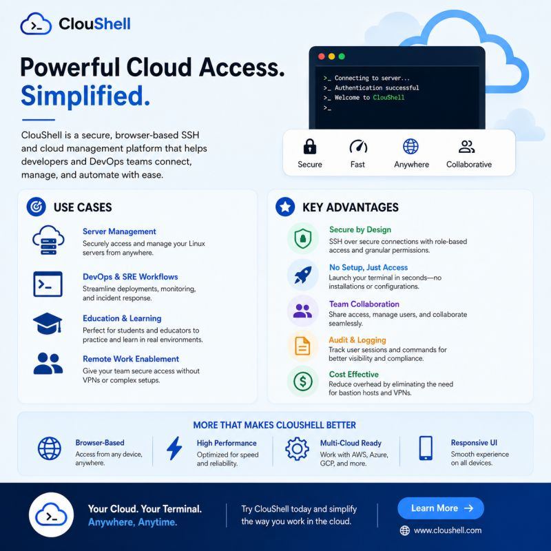
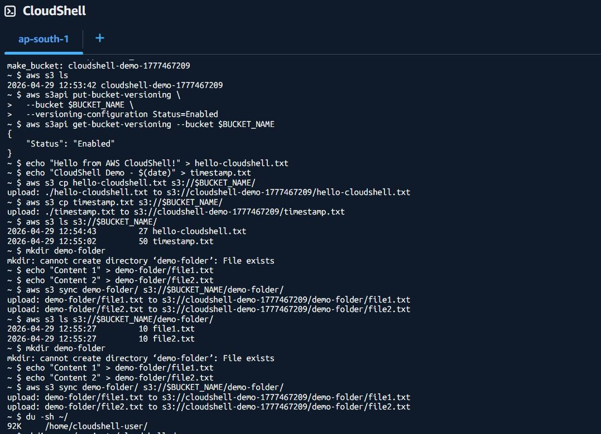
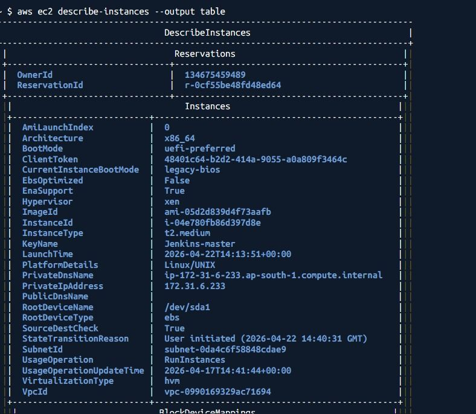
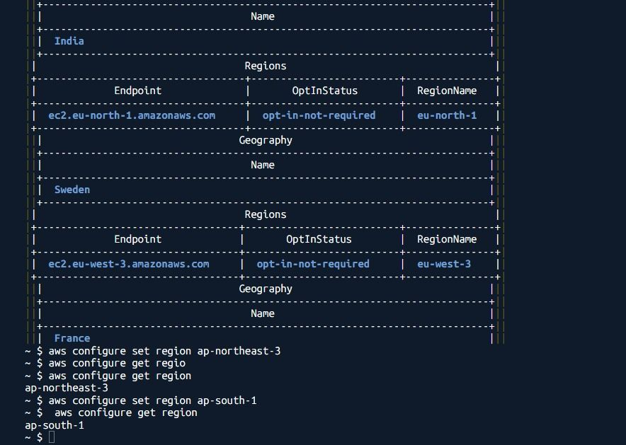
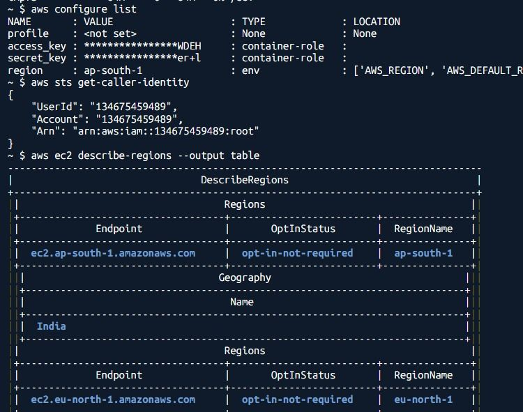
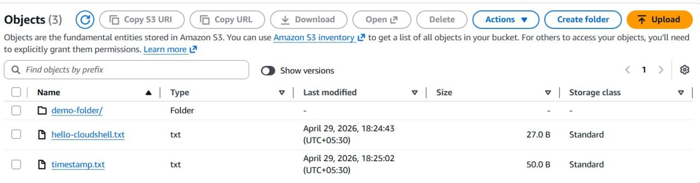

#  Secure AWS Infrastructure Management with CloudShell

##  Project Overview
**Objective:** Implement secure, secretless AWS CLI operations using AWS CloudShell.  
**Focus:** IAM Identity Verification, S3 Operations, and Security Boundary Enforcement.  
**Status:** ✅ Completed

---

## 🚀 The Challenge: Credential Management Risks
Managing cloud infrastructure via local CLI often introduces security risks:
- ❌ Hardcoded `AWS_ACCESS_KEY_ID` in scripts.
- ❌ Expiring credential files requiring manual rotation.
- ❌ Environment variable leakage in local shells.
- ❌ Inconsistent environments across team members.

**Goal:** Establish a standardized, secure entry point for cloud operations that eliminates credential handling overhead.

---

## ✅ The Solution: AWS CloudShell
AWS CloudShell provides a managed shell environment that standardizes security and access.

### Key Benefits Implemented
- **Pre-authenticated Sessions:** Uses IAM Session Profiles automatically.
- **Zero Secret Management:** No need to store keys in `~/.aws/credentials`.
- **Persistent Storage:** Home directory persists across sessions.
- **Secure Boundary:** Operations are confined within IAM policy permissions.

---

##  Architecture: Secure CLI Integration Flow
Understanding the security boundary between the CLI and AWS Infrastructure is critical for DevOps engineering.

### The Request Pipeline
1. **User Input:** CLI command issued (e.g., `aws s3 mb`).
2. **Session Auth:** CloudShell validates the active IAM session.
3. **Role Assumption:** CLI automatically assumes the configured IAM Role.
4. **Request Signing:** CLI signs the API request using **Signature Version 4 (SigV4)**.
5. **API Processing:** AWS Service (S3) validates the signature and policy.
6. **Response:** Secure data return to the shell.

---

##  Implementation & Lab Demos

### 1️⃣ CloudShell Environment Initialization
Launching the managed shell environment. The interface provides immediate access to AWS tools without login prompts.


### 2️⃣ IAM Identity Verification
Verifying the active identity and permissions linked to the session. This ensures the principle of least privilege is maintained.


### 3️⃣ Secretless S3 Bucket Creation
Executing infrastructure changes without exposing credentials. The script uses dynamic naming for uniqueness.


### 4️⃣ Operation Verification
Confirming the resource creation via CLI output. The success response indicates proper IAM policy attachment.


### 5️⃣ Region & Configuration Check
Validating the region context (`ap-south-1`) to ensure resources are deployed in the correct compliance boundary.


### 6️⃣ Console State Sync
Final verification in the AWS Console. The infrastructure state matches the CLI execution, confirming API consistency.


---

## 💻 Code Snippet: Dynamic Bucket Creation
```bash
# Generate unique bucket name using timestamp
BUCKET_NAME="cloudshell-demo-$(date +%s)"

# Create bucket without any credential flags
aws s3 mb s3://$BUCKET_NAME