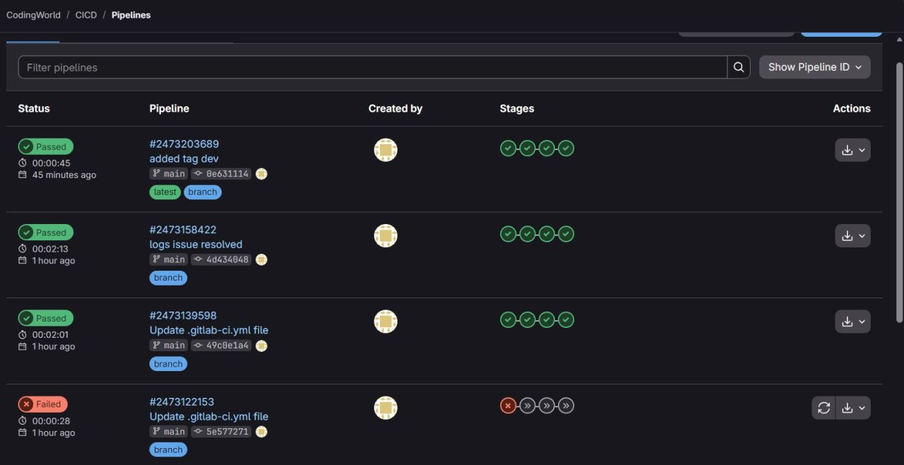
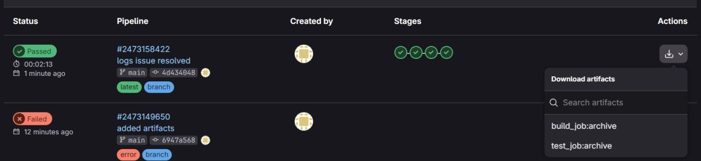
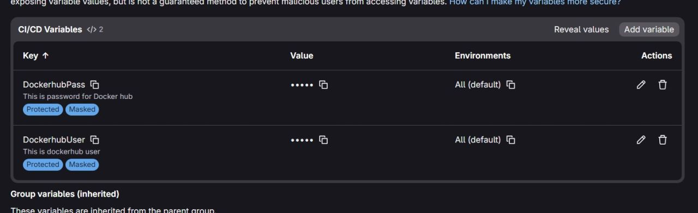
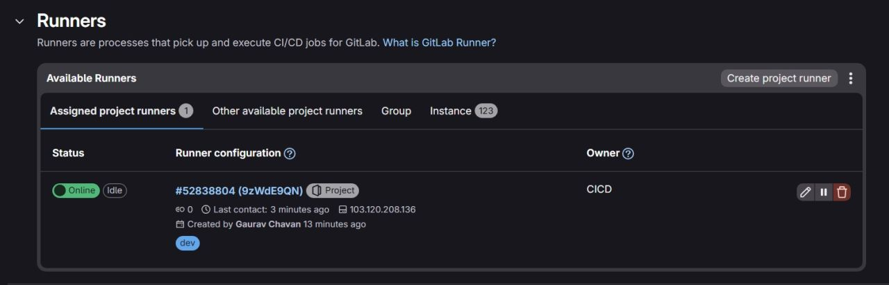
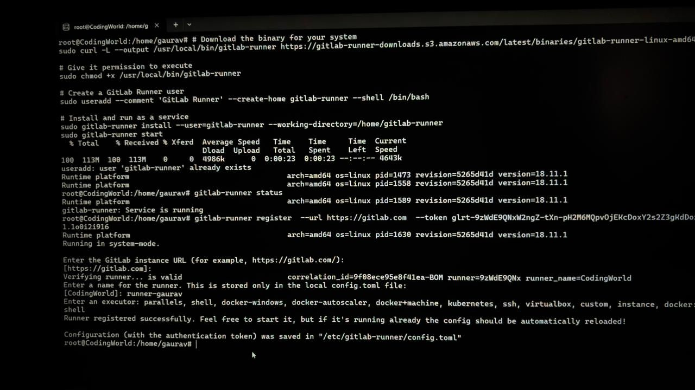

# 🚀 Production-Style CI/CD Pipeline with GitLab

## 🎯 Project Overview
**Objective:** Build secure, automated CI/CD pipeline with GitLab CI/CD.  
**Focus:** Variable Management, GitLab Runners, Artifacts, DockerHub Integration.  
**Status:** ✅ Completed

---

## 🚀 The Challenge: Manual Deployment Risks
Traditional manual deployment processes introduce significant risks:
- ❌ Hardcoded credentials in source code (`.gitlab-ci.yml`).
- ❌ Inconsistent deployment across environments.
- ❌ No artifact versioning or rollback capability.
- ❌ Manual testing leads to human errors.
- ❌ No audit trail for deployments.

**Goal:** Establish a secure, automated pipeline with proper secret management and artifact handling.

---

## ✅ The Solution: GitLab CI/CD Pipeline
GitLab CI/CD provides end-to-end automation with built-in security features.

### Key Benefits Implemented
- **Secure Variable Management:** Masked + Protected CI/CD variables.
- **Automated Pipeline:** `build → test → push` workflow.
- **Artifact Storage:** Build and test outputs preserved across jobs.
- **Runner Isolation:** Dedicated execution environment with tags.
- **Audit Trail:** Complete pipeline history with logs.

---

## 🏗️ Architecture: CI/CD Pipeline Flow

```
Code Commit → GitLab Pipeline → Runner Executes → DockerHub Push
     ↓              ↓                 ↓                  ↓
  Git Repo      Orchestration    Execution Engine    Container Registry
```

### Core Components

| Component | Purpose | Key Learning |
| :--- | :--- | :--- |
| **GitLab CI/CD** | Orchestration Layer | Defines pipeline structure |
| **GitLab Runner** | Execution Engine | Actually executes jobs |
| **Artifacts** | Job Output Storage | Preserves build/test outputs |
| **Variables** | Secure Secret Injection | Credentials without hardcoding |

> 💡 **Key Insight:** GitLab itself does NOT execute jobs — the Runner does. Without a Runner, pipelines are just definitions.

---

## 🛠 Implementation & Pipeline Demos

### 1️⃣ Pipeline Execution Overview
Multiple pipeline runs showing successful builds and debugging failed pipelines. Green checkmarks indicate passed stages.


---

### 2️⃣ Artifact Management
Downloadable artifacts from build and test jobs. Enables artifact versioning and rollback capability.


---

### 3️⃣ Secure Variable Configuration
CI/CD variables with **Masked** (prevents log exposure) and **Protected** (limits to protected branches) enabled.


---

### 4️⃣ GitLab Runner Installation
Terminal output showing Runner installation, registration, and service configuration on Linux EC2 instance.


---

### 5️⃣ Runner Configuration & Status
Registered Runner showing **Online** status with proper tags (`dev`) for job assignment.


---

## 🔐 Security Implementation

### Variable Security Best Practices

| Setting | Purpose | Why It Matters |
| :--- | :--- | :--- |
| **Masked** | Prevents variable values in job logs | No credential exposure in CI/CD logs |
| **Protected** | Limits variable to protected branches only | Only `main`/`production` can access secrets |
| **Environment Scope** | Restricts variables to specific environments | Prevents cross-environment leakage |

### Credentials Management

```yaml
# ❌ WRONG: Hardcoded credentials (NEVER DO THIS)
deploy:
  script:
    - docker login -u admin -p password123

# ✅ CORRECT: Using CI/CD Variables
deploy:
  script:
    - docker login -u $DOCKERHUB_USER -p $DOCKERHUB_PASS
```

> 🔒 **Security in CI/CD is not optional — credentials must never live inside source code.**

---

## 🛠 Real Problems Solved

| Issue | Root Cause | Solution |
| :--- | :--- | :--- |
| **YAML Syntax Errors** | Incorrect indentation/stage definition | Debugged stage by stage |
| **Runner Not Picking Jobs** | Tags mismatch or Runner offline | Fixed tags & verified online status |
| **Failed Pipeline** | Docker authentication failure | Checked logs → Fixed credentials → Re-ran |
| **Artifact Not Found** | Wrong artifact path configuration | Updated `paths` in `.gitlab-ci.yml` |

---

## 💻 Pipeline Configuration Snippet

```yaml
stages:
  - build
  - test
  - push

variables:
  DOCKER_IMAGE: myapp:$CI_COMMIT_SHA

build:
  stage: build
  script:
    - docker build -t $DOCKER_IMAGE .
  artifacts:
    paths:
      - build/

test:
  stage: test
  script:
    - docker run $DOCKER_IMAGE npm test
  artifacts:
    paths:
      - test-results/

push:
  stage: push
  script:
    - docker login -u $DOCKERHUB_USER -p $DOCKERHUB_PASS
    - docker push $DOCKER_IMAGE
  only:
    - main
```

---

## 📊 Pipeline Results

| Metric | Value |
| :--- | :--- |
| **Total Pipelines** | 4+ successful runs |
| **Pipeline Duration** | ~2-3 minutes average |
| **Stages** | build → test → push |
| **Security** | Masked + Protected Variables |
| **Artifacts** | Build & Test outputs preserved |
| **Runner Status** | Online & Tagged (`dev`) |

---

## 🔒 Best Practices Implemented

```bash
✅ No hardcoded credentials in .gitlab-ci.yml
✅ Masked variables prevent log exposure
✅ Protected variables limit branch access
✅ Artifacts preserved for debugging & rollback
✅ Runner tags for job assignment control
✅ Pipeline logs reviewed for security issues
✅ Failed pipelines debugged stage by stage
```

