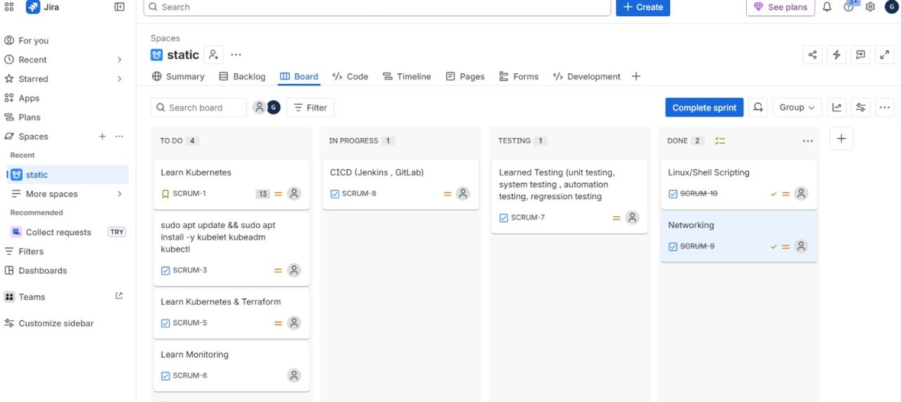

# 📋 Agile Project Management with Jira

## 🎯 Project Overview
**Objective:** Implement Agile/Scrum methodology to track DevOps learning journey.  
**Focus:** Sprint Planning, Task Tracking, Workflow Visualization.  
**Status:** ✅ Completed

---

## 🚀 The Challenge: Unstructured Learning Tracking
Managing complex DevOps topics without a structured system often leads to:
- ❌ Scattered tasks across notes and bookmarks.
- ❌ No visibility on progress or bottlenecks.
- ❌ Missed learning goals due to lack of sprint planning.
- ❌ Difficulty in demonstrating soft skills to recruiters.

**Goal:** Establish a professional project management workflow using industry-standard tools.

---

## ✅ The Solution: Jira Agile Board
Jira provides a centralized platform for managing tasks using Scrum/Kanban methodologies.

### Key Benefits Implemented
- **Visual Workflow:** Clear visibility of TO DO → IN PROGRESS → TESTING → DONE.
- **Sprint Planning:** Breaking down large topics into manageable tasks.
- **Issue Tracking:** Proper labeling, prioritization, and status updates.
- **Portfolio Evidence:** Demonstrates Agile proficiency to employers.

---

## 🏗️ Architecture: Agile Workflow Flow
Understanding the task lifecycle is critical for DevOps team collaboration.

### The Task Pipeline
1. **Backlog Grooming:** Identifying learning topics (K8s, Terraform, etc.).
2. **Sprint Planning:** Selecting tasks for the current sprint cycle.
3. **In Progress:** Active learning and hands-on implementation.
4. **Testing:** Validating knowledge through labs and documentation.
5. **Done:** Task completed and documented in portfolio.

---

## 🛠 Implementation & Board Overview

### 📊 Active Sprint Board



### Board Columns Explained

| Column | Purpose | Example Tasks |
| :--- | :--- | :--- |
| **TO DO** | Planned tasks for the sprint | Learn Kubernetes, Learn Monitoring |
| **IN PROGRESS** | Currently working on | CICD (Jenkins, GitLab) |
| **TESTING** | Validation & verification | Learned Testing (unit, automation) |
| **DONE** | Completed tasks | Linux/Shell Scripting, Networking |

---

## 🎫 Issue Tracking Details

### Sample Sprint Tasks

| Issue ID | Task | Status | Priority |
| :--- | :--- | :--- | :--- |
| SCRUM-1 | Learn Kubernetes | TO DO | High |
| SCRUM-3 | sudo apt update && kubelet setup | TO DO | High |
| SCRUM-5 | Learn Kubernetes & Terraform | TO DO | Medium |
| SCRUM-6 | Learn Monitoring | TO DO | Medium |
| SCRUM-7 | Testing (unit, automation) | TESTING | Medium |
| SCRUM-8 | CICD (Jenkins, GitLab) | IN PROGRESS | High |
| SCRUM-9 | Networking Fundamentals | DONE | High |
| SCRUM-10 | Linux/Shell Scripting | DONE | High |

---

## 💻 Sprint Goal Structure

```bash
# Sprint Goal: Core Infrastructure & Containerization
# Duration: 2 Weeks

## Backlog Items
- [ ] SCRUM-1: Learn Kubernetes Fundamentals
- [ ] SCRUM-2: Setup EKS Cluster
- [ ] SCRUM-3: Implement CI/CD Pipeline

## Definition of Done
✅ Lab completed
✅ Documentation written
✅ Code pushed to GitHub