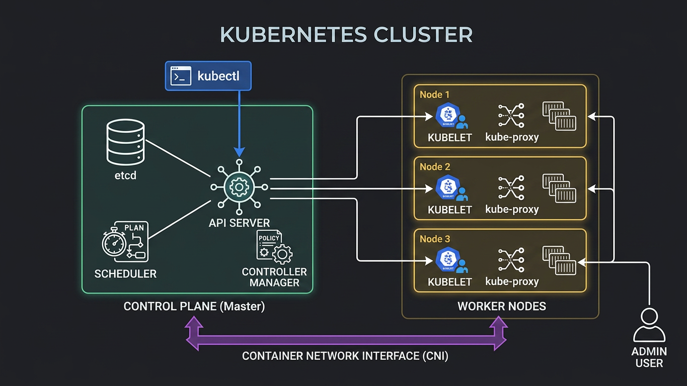

# 📘 Kubernetes Architecture Deep Dive

---

Objective
To move beyond basic `kubectl` commands and understand the internal communication flow, components, and responsibilities within a Kubernetes Cluster.

---

🏗️ Cluster Overview

A Kubernetes cluster is divided into two main parts: the Control Plane (decision maker) and the Worker Nodes (work executors).

---

🧠 Control Plane Components

| Component | Port | Responsibility |
| :--- | :--- | :--- |
| kube-apiserver | `6443` | Frontend of the control plane. Validates & configures data for APIs. |
| etcd | `2379` | Consistent & highly-available key-value store for all cluster data. |
| kube-scheduler | `10259` | Watches for newly created Pods with no assigned node & selects a node for them to run on. |
| kube-controller-manager | `10257` | Runs controller processes (e.g., Node Controller, Replication Controller). |

---

⚙️ Worker Node Components

| Component | Port | Responsibility |
| :--- | :--- | :--- |
| kubelet | `10250` | Agent that runs on each node. Ensures containers are running in a Pod. |
| kube-proxy | `N/A` | Network proxy. Maintains network rules & enables communication to Pods. |
| Container Runtime | `N/A` | Software responsible for running containers (e.g., `containerd`, `CRI-O`). |

---

🔄 The Life of a Request (`kubectl apply`)

1. Authentication: `kubectl` sends request to API Server.
2. Validation: API Server validates the request.
3. Storage: Data is saved in etcd.
4. Scheduling: Scheduler detects new Pod & assigns a Node.
5. Execution: Kubelet on the assigned node pulls the image & starts the container.
6. Networking: Kube-proxy updates rules to route traffic to the new Pod.

---

🛠️ Debugging & Verification Commands

```bash
# Check control plane components
kubectl get componentstatuses

# Check all nodes status
kubectl get nodes -o wide

# View API server logs (if accessible)
kubectl logs -n kube-system -l component=kube-apiserver

# Check kubelet status on node
systemctl status kubelet
```

---

> [!NOTE]
> Learning Context: Revised this architecture while traveling. Consistency > Perfect Setup.
>
> Credit: Concepts clarified via **TrainWithShubham** resources.

---

📅 Last Updated: 2025  
👤 Author: Gaurav
```
